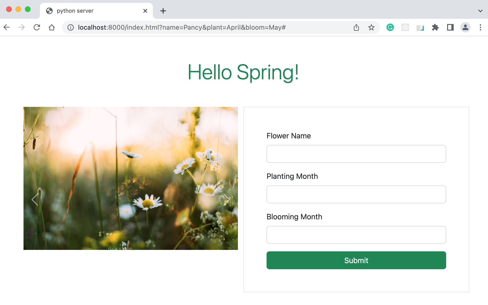

# How Web Works Exercise

### Part One: Solidify Terminology

In your own terms, define the following terms:

- What is HTTP?

  > HTTP stands for HyperText Transfer Protocol. It is a highlevel application protocol used for the communication between browsers and web servers.

- What is a URL?

  > URL stands for Uniform Resource Locator. It is used to locate and retrieval resources in the Internet.

- What is DNS?

  > DNS stands for Domain Naming System. It is a web service which converts an internet IP addresses in number strings and domain names in plain English.

- What is a query string?

  > A query string contains key-value pairs enbedden in an URL which is used to get restources from a web server.

- What are two HTTP verbs and how are they different?

  > Theere are GET and POST. GET has no side effects on the server, and query info is embedded in URL. On the other hand, POST may bring changes to the resources at the server, e.g., updating records in a database, and query info is in request body.

- What is an HTTP request?

  > It is the info sending from a web browser to a web server to get info from or post info to the server.

- What is an HTTP response?

  > After a web browser sent a rquest to a web server, the return from the server is call HTTP response.

- What is an HTTP header? Give a couple examples of request and response headers you have seen.

  > An HTTP header is a piece of meta data in HTTP request or response. It is used to tell the other end of communication about the request/response. For instance, Request method in request, and Content-Length in response.

- What are the processes that happen when you type “http://somesite.com/some/page.html” into a browser?
  > First the browser checks if the requested page is saved in the computer, if not, it needs DNS to find the IP address of the hostname, and send a HTTP request to the server. Then the server sends the response back to the browser to render it to a regular web page. The browser may send more requests to retrieve resources needed for the page.

### Part Two: Practice Tools/Part Three: Explore Dev Tools

1. Using curl, make a GET request to the icanhazdadjoke.com API to find all jokes involving the word “pirate”

```bash
$ curl https://icanhazdadjoke.com/search?term=pirate
    What did the pirate say on his 80th birthday? Aye Matey!
    What does a pirate pay for his corn? A buccaneer!
    Why couldn't the kid see the pirate movie? Because it was rated arrr!
    Why are pirates called pirates? Because they arrr!
    Why do pirates not know the alphabet? They always get stuck at "C".
```

2. Use dig to find what the IP address is for icanhazdadjoke.com

```bash
$ dig icanhazdadjoke.com

; <<>> DiG 9.10.6 <<>> icanhazdadjoke.com
;; global options: +cmd
;; Got answer:
;; ->>HEADER<<- opcode: QUERY, status: NOERROR, id: 8762
;; flags: qr rd ra; QUERY: 1, ANSWER: 2, AUTHORITY: 0, ADDITIONAL: 1

;; OPT PSEUDOSECTION:
; EDNS: version: 0, flags:; udp: 512
;; QUESTION SECTION:
;icanhazdadjoke.com.		IN	A

;; ANSWER SECTION:
icanhazdadjoke.com.	125	IN	A	104.21.66.15
icanhazdadjoke.com.	125	IN	A	172.67.198.173

;; Query time: 35 msec
;; SERVER: 2601:40a:8103:8fe0:2694:cbff:feb3:6218#53(2601:40a:8103:8fe0:2694:cbff:feb3:6218)
;; WHEN: Sun May 14 02:02:59 EDT 2023
;; MSG SIZE  rcvd: 79
```

3. Make a simple web page and serve it using python3 -m http.server. Visit the page in a browser.

```bash
$ python -m http.server
Serving HTTP on :: port 8000 (http://[::]:8000/) ...
```



### Part Four: Explore the URL API
